```mermaid
---
config:
 look: handDrawn
title: FlowChart
---
flowchart TB
	start([Start]) --> import[Import socket, threading, prompt, time modules]
	import --> ask_for_rule[/Ask for role: Create room or Join?/]
	
	ask_for_rule --> ask_for_ip[/Ask for the destnation ip?/]
	ask_for_ip --> ask_for_port[/Ask for the port?/]
	ask_for_port --> is_admin{if the role is:}
	
	is_admin -- Create room --> bind_port1[Make:
	sending_port = port
	receving_port = port + 1] -..- node@{ shape: sm-circ, label: "node" }
	
	is_admin -- Join room --> bind_port2[Make:
	sending_port = port + 1
	receving_port = port] -..- node
	
	node --------------> bind_socket@{ shape: processes, label: "Bind two sockets to send and receive masseges" }

	threads@{ shape: processes, label: "Start TWO threads" }
	bind_socket --> start_process1
	continue1 --> start_process2
	
	subgraph bind receiver socket
		start_process1@{ shape: circle, label: "Try" }
		start_process1 --> try1[create receiver socket]
		try1 --> except1{Error?}
		except1 -- Yes --> wait1[Wait for 1 sec] 
		wait1 --> start_process1
		except1 -- No --> continue1@{ shape: dbl-circ, label: "Continue" }
	end
	
	subgraph bind sender socket
		start_process2@{ shape: circle, label: "Try" }
		start_process2 --> try2[create sender socket]
		try2 --> except2{Error?}
		except2 -- Yes --> wait2[Wait for 1 sec] 
		wait2 --> start_process2
		except2 -- No --> continue2@{ shape: dbl-circ, label: "Continue" }
	end

	continue2 ------> threads 


	threads --> start_process3
	threads --> start_process4
	
	subgraph receiving thread
		start_process3@{ shape: circle, label: "Start" }
		start_process3 --> accept[Wait to accept sender connection]
		accept --> wait3[Wait for a massege]
		wait3 --> massege1{Massege has a value?}
		massege1 -- Yes --> print_massege[/Print the massege/]
		print_massege ----> wait3
		massege1 -- No --> break1@{ shape: dbl-circ, label: "Break" }
	end

	subgraph sending thread
		start_process4@{ shape: circle, label: "Start" }
		start_process4 --> input1[/Input a massege to send/]
		input1 ----> massege2{Massege has a value?}
		massege2 -- Yes --> send[Send the massege]
		send ----> input1
		massege2 -- No --> break2@{ shape: dbl-circ, label: "Break" }
	end


	break1 -----> node2@{ shape: sm-circ, label: "node2" }
	break2 -----> node2

	node2 ==> exit([Exit])
```

# ***Whatsdown***

Whatsdown is a lightweight, LAN-based CLI messaging app built with Python. With Whatsdown, you can easily create or join chatrooms on your local network. It uses Python's standard libraries along with `prompt_toolkit` for a smooth, non-interruptive user interface.

---

## Features

- **Create or Join Chatrooms:** Choose to either host a chatroom or join an existing one.
- **LAN Networking:** Connect with a partner on the same local network.
- **Asynchronous Messaging:** Enjoy uninterrupted typing while incoming messages are handled seamlessly.
- **Clean CLI Interface:** Uses `prompt_toolkit` to ensure incoming messages do not interfere with your inputs.

---

## Requirements

Whatsdown is built with Python and requires the following libraries:

- `socket`
- `threading`
- `time`
- [`prompt_toolkit`](https://python-prompt-toolkit.readthedocs.io/)

### Installation via Package Managers

Depending on your operating system, you can install `python` and `prompt_toolkit` using your system's package manager:

- **Debian/Ubuntu:**
  ```bash
  sudo apt update -y && apt install python3 python3-prompt_toolkit
  ```

- **Arch Linux (Pacman):**
  ```bash
  sudo pacman -S python python-prompt_toolkit
  ```

- **Fedora** (Python is already installed):
  ```bash
  sudo dnf install python3-prompt_toolkit
  ```

If your distribution doesn’t support these packages directly, you can always install `prompt_toolkit` via pip:

```bash
pip install prompt_toolkit
```

---

## How It Works

1. **Room Selection:**  
   When you start Whatsdown, you’ll be prompted with the following message to choose whether to create a chatroom or join one:
   ```plaintext
   do you want:
       1. Create chatroom.
       2. Join to chatroom.
   Enter a valid option:
   ```
   This organizes the port configuration for sending and receiving messages.

2. **Enter Partner IP:**  
   Next, you will be prompted to enter your partner’s IP address (must be within the same LAN):
   ```plaintext
   Enter your partner IP:
   ```

3. **Enter Partner Port:**  
   The app will then ask for a port number, with a force to choose one between 49152 and 65535:
   ```plaintext
   Enter your partner PORT (choose between 49152 and 65535):
   ```

4. **Establish Connection:**  
   After entering the details, Whatsdown waits for a connection. Once your partner connects, the chat session starts!

---

## Usage

Simply clone and run the Whatsdown Python script. The app will guide you through creating or joining a chatroom with clear prompts in your terminal.

```bash
git clone https://github.com/ex-jandal/whatsdown.git ~/whatsdown
cd ~/whatsdown
python main.py
```

---

## Troubleshooting

- **Connection Issues:**  
  - Verify that both parties are on the same LAN.
  - Ensure the IP address and port number are correct and not in use by another service.
  - Check firewall settings that might be blocking the connection.

- **Port Selection:**  
  If you experience issues related to port binding, remember to choose a port between 49152 and 65535, which are typically available for user applications.

---

## FAQ

**Q: Do I need to install any additional software besides Python?**  
A: No, Whatsdown only requires Python and the listed libraries. For `prompt_toolkit`, you can use your system's package manager or pip.

**Q: Can I use Whatsdown over the internet?**  
A: Whatsdown is designed for LAN usage. For internet usage, you would need to configure port forwarding and take additional security measures.

**Q: What happens if my partner disconnects?**  
A: The app will print a alert and close your partner socket if you partner sent you an empty message. if you partner interrupt or close the app, the app will show you an error message.  You can restart the app and try reconnecting again if you or your partner do it by mistake.

---

Enjoy chatting on your LAN with Whatsdown! If you encounter any issues or have further questions, feel free to consult this README for guidance.

---  
<span style="color: orange;">Done</span> With ❤️ by ***Sultan Majed***


